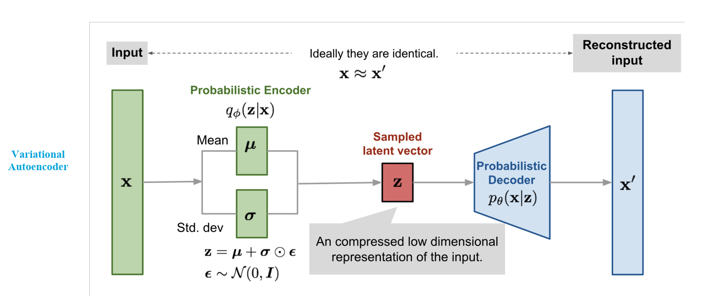

# Variant-AutoEncoder

*Knowledge provided by* [AI VIET NAM](https://aivietnam.edu.vn/) 

    

Variational autoencoders (VAE) are deep learning models composed of an encoder that learns to isolate the important latent variables from training data and a decoder that then uses those **latent variables** to reconstruct the input data.

However, whereas most autoencoder architectures encode a discrete, fixed representation of latent variables, VAEs encode a continuous, probabilistic representation of that latent space. This enables a VAE to not only accurately reconstruct the exact original input, but also use variational inference to generate new data samples that resemble the original input data.

VAEs are a subset of the larger category of autoencoders, a neural network architecture typically used in deep learning for tasks such as data compression, image denoising, anomaly detection and facial recognition.

## :question: What is the autoencoder?
Autoencoders are self-supervised systems whose training goal is to compress (or encode) input data through dimensionality reduction and then accurately reconstruct (or decode) their original input by using that compressed representation.

On a fundamental level, the function of an autoencoder is to effectively extract the data’s most salient information—its latent variables—and discard irrelevant noise. What distinguishes different types of autoencoders from one another is the specific strategy they employ to extract that information and the use cases to which their respective strategy is best suited.

While the encoder and decoder networks of many autoencoders are built from standard multilayer perceptrons (MLPs), autoencoders are not confined to any specific type of neural network.

Autoencoders used for computer vision tasks are often convolutional neural networks (CNNs) and are thus called convolutional autoencoders. Autoencoders built from transformer architecture have been used in multiple fields, including computer vision3 and music.4 

A key benefit of autoencoders over other dimensionality reduction algorithms, such as principal component analysis (PCA), is that autoencoders can model nonlinear relationships between different variables. For that reason, the nodes of autoencoder neural networks typically use nonlinear activation functions.

In many autoencoder applications, the decoder serves only to aid in the optimization of the encoder and is thus discarded after training. In variational autoencoders, the decoder is retained and used to generate new data points.

## :muscle: How to VAEs work?
Variational Autoencoder (VAE) belongs to the family of generative models, with the mathematical formulation:

$$p_{\theta}(x,z) = p_{\theta}(z)p(x|z)$$

where **$p_{\theta}(z)$** is typically a Gaussian distribution, and **$p(x|z)$** is usually sampled from an exponential family distribution (such as Gaussian or Bernoulli) with parameters computed by a neural network decoder $d_{\theta}(z)$. For example, with binary observations, we can use:

$$p_{\theta}(z) = \prod_{d=1}^{D}Ber(x_{d}|{\sigma}(d_{\theta}(z))$$

VAE is well-suited for identity modeling using:
$$q_{\phi}(z|x) = q(z|e_{\phi}(x)) \approx p_{\theta}(z|x)$$

to approximate posterior inference. Here, $q_{\phi}(z|x)$ is typically a Gaussian distribution with parameters computed by a neural network encoder **$e_{\phi}(x)$**:

$$q_{\phi}(z|x) = q(z|e_{\phi}(x)) \approx p_{\theta}(z|x)$$

The model encodes the input $x$ into a stochastic latent bottleneck $z$ and then decodes $z$ to approximate the reconstruction of the input.

The task of $e_{\phi}(x)$ is to encode the input to generate two vectors: the mean vector $\mu$ and the variance vector $l$, where $l$ = log $\sigma$

$$ (u,l) = e_{\phi}(x)$$

These two vectors serve as the mean $\mu$ and standard deviation $\sigma$ of a Gaussian distribution $\mathcal{N} (\mu, \sigma)$. This distribution is used to sample $z$:

$$z = \mathcal{N} (z|\mu, \sigma) $$

Then, $z$ is passed through the decoder network $d_{\theta}(z)$ to reconstruct an approximation of the input.

### :eyes: Input Dataset:
The input dataset is $D$ = { $x^{1},..., x^{n}$ }, which follows a probability distribution $p_D(x) \in P_D$ .

The best distribution that fits the data $D$ is obtained by **minimizing the KL divergence:**

$$\min_{p \in {P_(x,z)}} D_{KL} \ (p_D(x)||p_\theta(x))$$

where $p_{\theta}(x)$ is the model output (generated by the decoder $d_{\theta}(z)$ ). **Optimizing** an **empirical estimate** of the **KL divergence** is equivalent to maximizing the marginal log-likelihood $p_{\theta}$ as follows:

-   $p_{z} \in P_z$ represents the probability distribution of the latent variable $z$.

-   The joint generative distribution of $x$ and $z$ is given by:

$$ p_\theta(x,z) = p_\theta(z)p_\theta(x|z) = p_\theta(x) p_\theta(z|x)$$

-   From the **joint distribution**, the **marginal distribution** is obtained as:

$$p_\theta(x) = \int_{z}p_\theta(x,z)dz = \int_{z} p_\theta(z) p_\theta(x|z)dz \quad (1)$$

-   **Applying to the entire dataset** $D$ we maximize:

$$ \max_{p \in {P_(x,z)}} \sum_{x \in D} \log (p(x)) = \sum_{x \in D} log \int p(x,z)dz$$

$$\Longrightarrow p_\theta(z|x)  = \frac{p_\theta(x,z)}{p_\theta(x)} \quad (*)$$ 

From Equation (1), we define the relationship between the input data $x$ and the latent variable $z$ as:

-   **Prior:** $p_{\theta}(z)$ 
-   **Likelihood:** $p_{\theta}(x|z)$
-   **Posterior:** $p_{\theta}(z|x)$

### :boom: Compute Challenge:

Computing $p_{\theta}(z|x)$ is difficult because $x$ has **high dimensionality**, which requires evaluating an **intractable integral** (or sum, in the case of discrete $z$).

An alternative approach is to use **Monte Carlo sampling**. For each specific data point $x$, we can estimate the marginal log-likelihood as:

$$ \log (p(x)) \approx \log \frac1{k} \sum^{k}_{i=1} p(x|z^{i}), with \quad z^{i} \thicksim p(z) \quad (2)$$

:no_entry_sign: **Observation: Optimizing Equation (2) suffers from high variance in gradient estimation.** :no_entry_sign:

:bulb: Instead of directly optimizing the log-likelihood function, an alternative method is to construct a **lower bound function (ELBO)** that is easier to optimize.

### :bulb::bulb::bulb: Main Method::bulb::bulb::bulb:
From the equation (*), we can see that the primary objective of **VAE** is to approximate the posterior $p_{\theta}(z|x)$. To achieve this, we use a family of variational distributions $Q$ parameterized by $\phi$:

$$\log p_\theta(x) = \log \int p_\theta(x,z)dz$$

$$= \log \int \frac{q_\phi(z|x)}{q_\phi(z|x)} p_\theta(x,z)$$

$$\geq \int q_\phi(z|x) \log \frac{p_\theta(x,z)}{q_\phi(z|x)} dz$$

$$\geq E_{q_\phi(z|x)} \left[ \log \frac{p_\theta(x,z)}{q_\phi(z|x)} \right]$$

$$\rightarrow \log p_\theta(x) - E_{q_\phi(z|x)} \left[ \log \frac{p_\theta(x,z)}{q_\phi(z|x)} \right] = D_{KL} (q_\phi(z|x) || p_\theta(z|x)) \quad (**)$$

$$= \mathbf{ELBO} (x; \theta, \phi)$$

In the final step, we applied **Jensen’s inequality**. The condition for evaluating **ELBO** is that it must be an unbiased **Monte Carlo** estimate that can be computed as:

$$\frac{1}{k} \sum^{k}_{i=1} \log \frac{p_{\theta}(x, z^i)}{q_{\phi}(z^i)} \quad with \quad z^{i} \thicksim q_{\phi}(z|x) \quad (***) $$

The choice of the variational distribution $q_{\phi}(z|x)$ is crucial. Equation $(***)$ holds for any parameterization of $\phi$, but the tightness of **ELBO** heavily depends on the specific choice of $q$. A good variational distribution should be flexible enough to closely approximate the true posterior $p(z|x)$ while also being simple enough to allow efficient sampling and density evaluation of $q_{\phi}(z)$.

In practice, the selection of the variational distribution often involves a trade-off between model **expressiveness** and **computational efficiency**. Common choices include **mean-field variational inference**, where the variational distribution is factorized over latent variables, or more complex formulations depending on the specific model requirements.

The **optimization process** involves adjusting the variational parameters $\phi$ to improve the tightness of **ELBO**, thereby enhancing the quality of the approximation to the true posterior. The gap between $p_{\theta}$ and ELBO is precisely the **KL divergence** $D_{KL}$ between the approximate posterior $q_{\phi}(z|x)$ and the true posterior $p_{\theta}(z|x)$ . This discrepancy is minimized to **zero** when the variational distribution $p_{\phi}(z|x)$ matches the true posterior $p_{\theta}(z|x)$ exactly.

:key: **Conclusion**
In summary, we can learn a latent variable model by jointly maximizing both the model parameters $\phi$ for any given data point $x$:

$$ \max_{\theta} \sum_{x \in D} \max_{\phi} E_{q_{\phi}(z|x)} \left[ \log \frac{p_{\theta}(x,z)}{q_{\phi}(z|x)} \right] $$ 

## :chart_with_downwards_trend: Loss Function

The objective of the loss function in a Variational Autoencoder (VAE) is to:

-   Optimize the parameter $\theta$ to minimize the reconstruction error between input and output.

- Optimize the parameter $\phi$ so that the approximate posterior distribution $q_{\phi}(z|x)$ closely matches the true posterior $p_{\theta}(z|x)$.

From $(**)$, the **Evidence Lower Bound (ELBO)** is given by:

$$L_{(\theta, \phi)}(x) := E_{q_{\phi}(z|x)} [log \frac{p_{\theta}(x,z)}{q_{\phi}(z|x)}] $$  

$$= log p_\theta(x) - D_{KL} (q_\phi(z|x) || p_\theta(z|x)) $$

To **maximize** $\mathcal{L}_{(\theta, \phi)}(x)$, we:

-   **Maximize** log $p_\theta(x)$ (the likelihood term).

-   **Minimize** $D_{KL} (q_\phi(z|x) || p_\theta(z|x))$ (the KL divergence between the approximate posterior and the true posterior).

Thus, the **VAE loss function** can be rewritten as:

$$ L_{(\theta, \phi)}(x) = E_{q_\phi(z|x)} [log \frac{p_\theta(x,z)}{q_\phi(z|x)}] $$

$$= E_{q_\phi(z|x)} [log \frac{p_\theta(x|z) p_\theta(z)}{q_\phi(z|x)}] $$

$$= E_{q_\phi(z|x)} [log (p_\theta(x|z)) + log \frac{p_\theta(z)}{q_\phi(z|x)}] $$

$$= E_{q_\phi(z|x)} [log (p_\theta(x|z)) - log \frac{q_\phi(z|x)}{p_\theta(z)}] $$

$$= E_{q_\phi(z|x)} [log (p_\theta(x|z))] - E_{q_\phi(z|x)} [log \frac{q_\phi(z|x)}{p_\theta(z)}] $$

-   The **first** term: 
$$L_E = E_{q_\phi(z|x)} log (p_\theta(x|z))$$ 
represents the **reconstruction loss**, which measures how well the decoder can reconstruct the input data.
  
- The **second** term: 
- $$ L_R = E_{q_\phi(z|x)} \left[ \log \frac{q_\phi(z|x)}{p_\theta(z)} \right] $$ 
represents the **KL regularization term**, which ensures that the approximate posterior $q_{\phi}(z|x)$ does not deviate too much from the prior $p_{\theta}(z)$.

#### :key: Gradient Estimation:

The $\nabla_\theta ELBO$ and $\nabla_\phi ELBO$ are computed using **Monte Carlo sampling**.
-   The gradient with respect to $\theta$ can be estimated as: 

$$ \nabla_\theta E_{q_\phi(z|x)} \left[ \log \frac{p_\theta(x,z)}{q_\phi(z|x)} \right] = E_{q_\phi(z|x)} \left[ \nabla_\theta \log \frac{p_\theta(x,z)}{q_\phi(z|x)} \right] $$

which can be directly computed.

- However $\nabla_\phi ELBO$ cannot be directly computed because $\phi$ appears inside the probability distribution $q_{\phi}(z|x)$.

#### :key: Reparameterization Trick:

To address this issue, we apply the **reparameterization trick**, which introduces an auxiliary random variable $\epsilon$ with a fixed distribution $p(\epsilon)$ and ad differentiable transformation $T(\epsilon; \phi)$:
1.  **Sample** $\epsilon \thicksim p(\epsilon)$ where $p(\epsilon)$ is typically a standard normal distribution $\mathcal{N}(0,I)$
2.  **Transform** $\epsilon$ to obtain $z$: $$z = T(\epsilon; \phi)$$. This ensure that $z$ follows the approximate posterior $q_{\phi}(z|x)$.

:bulb: **Gaussian Posterior Assumption:**

We assume $q_{\phi}(z|x)$ follows a **Gausian distribution:**

$$ q_{\phi}(z|x) = \mathcal{N}(\mu_{\phi}(x), \Sigma_{\phi}(x)) $$ 

where:
-   $\mu_{\phi}(x)$ is the mean.
-   $\Sigma_{\phi}(x)$ is the covariance matrix.
  
By applying the **reparameterization trick**, we rewrite $z$ as:

$$ \mu_\phi(x) + L_\phi(x) \cdot \epsilon $$

where $L_\phi(x)$ is the Cholesky decomposition of the covariance matrix:

$$ \Sigma_{\phi}(x)) = L_\phi(x) L_\phi(x)^T $$

:bulb: **Computing the Gradient $\nabla_\phi ELBO$:**

Using the reparameterization trick, the gradient can now be rewritten as:

$$ \nabla_\phi E_{q_\phi(z|x)}[log \frac{p_\theta(x,z)}{q_\phi(z|x)}] = E_\epsilon [\nabla_\phi log \frac{p_\theta(x, \mu_\phi(x)+L_\phi(x)\cdot \epsilon)}{q_\phi(\mu_\phi(x) + L_\phi(x)|x)}] $$

:rocket: **Summary:**

:o: **The VAE loss function** consists of two terms:

:one: **Reconstruction Loss** $L_E$ ensures that the output is similar to the input. It which is measured using the **Mean Squared Error (MSE) Loss:** 

$$\frac{1}{N} \sum_{i=1}^{N} \left( x_D^i - x^i_{d_\theta(z)} \right)^2 $$

where:
- $x^{i}_{D}$  is the original input value.
- $ x^{i}_{d_\theta(z)} $  is the reconstructed output from the decoder.
- $N$ is the number of data samples.

:two: **KL Regularization Loss** $L_R$:

$$ E_{q_{\phi}(z|x)} \left[ \log \frac{q_{\phi}(z|x)}{p_\theta(z)} \right] $$

is denoted as the **KL regularizer loss term**:
-   The prior distribution $p_{\theta}(z)$ is sampled from a **standard normal distribution** $\mathcal{N}(0,I)$, so the KL loss term represents the divergence between two normal distributions:

$$ D_{KL}(\mathcal(N)(\mu, \sigma^2) || \mathcal{N}(0,I)) $$

$$ = - \frac{1}{2} \sum^{d}_{i=1} (1 + log(\sigma^2) - \mu^2 - \sigma^2) $$

-   The general formula for **KL divergence between two normal distributions** is given by:

$$ D_{KL}(\mathcal(N)(\mu_{1}, \sigma^2_{1}) || \mathcal{N}(\mu_{2}, \sigma^2_{2})) $$

$$ = \frac{1}{2} \sum_{i=1}^{d} \left( \frac{\sigma^2_1}{\sigma^2_2} + \frac{(\mu_2 - \mu_1)^2}{\sigma^2_2} - 1 + \log \left( \frac{\sigma^2_2}{\sigma^2_1} \right) \right) $$
